<h3 align="center">👋 Hi, I'm Poovarasan</h3>

Swift • UIKit • SwiftUI • iOS Development | 2.5+ Years Experience

---

I'm an <b>iOS Developer</b> with <b>2.5+ years of experience</b> building scalable and user-friendly mobile applications. 
I focus on creating clean, maintainable code and delivering reliable iOS applications from 
<b>development to App Store deployment</b>.

I enjoy building <b>reusable components</b>, improving <b>application performance</b>, and developing 
intuitive mobile experiences that provide real value to users.

<h3>💻 Tech Stack</h3>

Swift • UIKit • SwiftUI • REST APIs • Core Data • Xcode • Firebase • Git • MVC • MVVM • Auto Layout • 
Programmatic UI • Storyboard • XIBs • JSON Parsing • REST API's Integration • Push Notification • Light/Dark Mode Support • Core NFC • Core Bluetooth • Core Location • Firebase Auth • Debugging • App Store Deployment 

<h3>📱 Focus Areas</h3>

iOS Application Development • Mobile Architecture • Performance Optimization • Clean UI Development

# [Team Portal](https://apps.apple.com/us/app/emr-employee-app/id6742842353)
[View on App Store](https://apps.apple.com/us/app/emr-employee-app/id6742842353)

Team Portal is a workplace productivity and employee management application designed to improve
communication, collaboration, and daily workflow management within organizations.

The app provides employees with a centralized platform to manage meetings, tasks, and important
company updates. Key features include a meeting scheduler, task manager, to-do lists, company
announcements, attendance tracking, and access to essential HR services such as payslips and leave
information.

Designed with a focus on usability and performance, the application enables teams to stay organized,
track task progress, and collaborate efficiently whether working remotely or in the office.

  

**Tech Used**
- Swift
- UIKit
- Core Data
- REST APIs
- JSON Parsing
- Firebase Firestore (Real-time Chat)
- Push Notifications
- MVC Architecture
- Auto Layout
- Programmatic UI
- Customized UI Components
- Light & Dark Mode Support
- Git Version Control

# [SHOU EMA](https://apps.apple.com/lt/app/shouema/id6477866974)
[View on App Store](https://apps.apple.com/lt/app/shouema/id6477866974)

Air Quality Sensor App is an iOS application designed to collect and analyze indoor air quality data from NFC-enabled Nexelec SIGN sensors. The app allows users to scan sensors using their device’s NFC capability, retrieve environmental data, and visualize air quality metrics in an intuitive interface.

The application reads sensor information such as CO₂ levels, temperature, and humidity, enabling users to monitor indoor environmental conditions effectively. It also integrates with backend services to submit collected data, generate compliance reports, and send reports directly to recipients via email.

To support a wider audience, the app includes multi-language support (French and English) and focuses on delivering a smooth sensor interaction experience with clear data visualization.

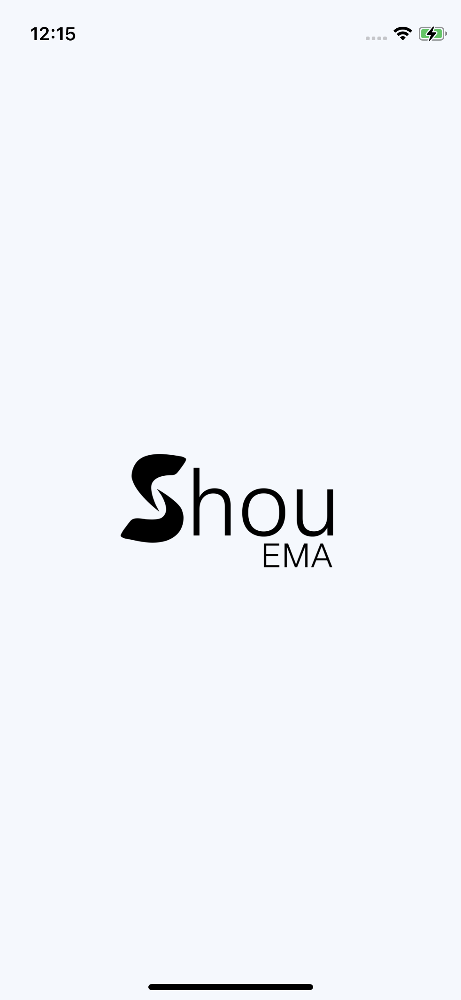
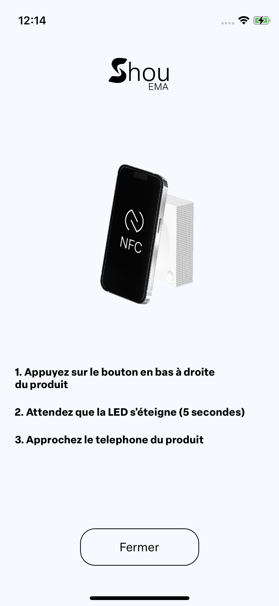
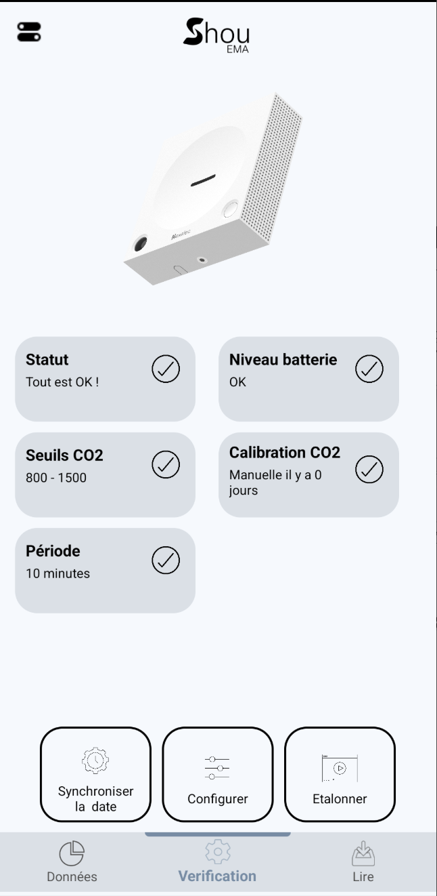
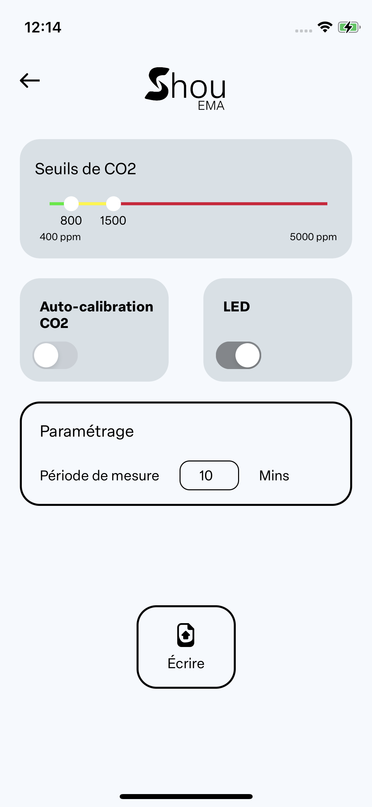
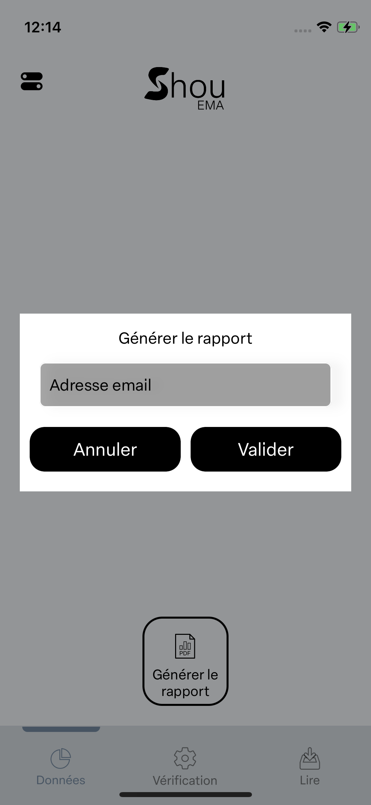
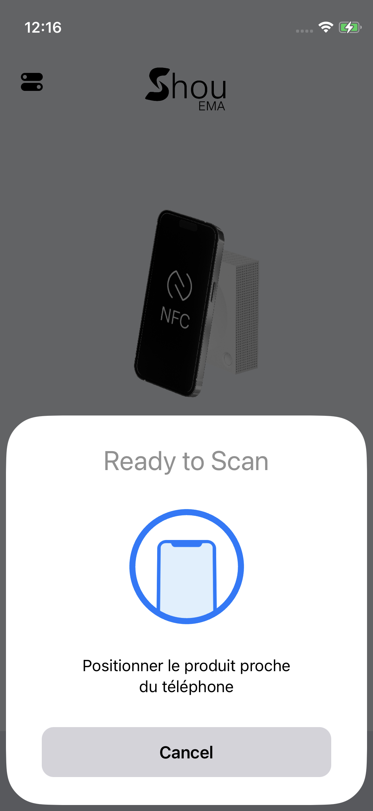

**Tech Used**
- Swift
- UIKit
- Core NFC
- REST APIs
- MVC Architecture
- Auto Layout
- Programmatic UI
- Localization (French / English)
- Git Version Control

# [SkyI (Pindrop)](https://apps.apple.com/lt/app/shouema/id6477866974)
BLE Asset Tracking App is an iOS application designed to detect and track assets using Bluetooth Low Energy (BLE) beacons and mobile GPS. The system allows assets to be registered through a secure invite-based MAC ID registration process, enabling them to be linked with backend services for tracking and monitoring.

The app supports crowd-assisted detection, where nearby user devices can detect registered BLE beacon MAC IDs and report the last-known location to the backend. This approach enables scalable asset visibility without requiring continuous live tracking.

Users can view historical detection locations on Apple Maps, including markers, route lines, and polylines, helping visualize asset movement and last-known positions. The application is designed with a battery-efficient, event-based detection mechanism to minimize device resource usage while maintaining reliable tracking functionality.

**Tech Used:**  
- Swift
- UIKit
- Core Bluetooth (BLE)
- Core Location (GPS)
- MapKit (Apple Maps)
- REST APIs
- MVC Architecture
- Auto Layout
- Programmatic UI
- Background Processing
- Git Version Control 

# [Nissi iLog](https://apps.apple.com/jo/app/nissi-ilog/id6547854369)
[View on App Store](https://apps.apple.com/jo/app/nissi-ilog/id6547854369)

Employee Activity Tracker is a workplace productivity application designed to help organizations monitor daily work updates, track task progress, and improve team accountability. The app enables employees to log their daily activities while allowing managers to review updates and approve tasks through a centralized system.

It provides modules for activity logging, task approvals, and real-time notifications, ensuring smooth communication between employees and management. Data is synchronized in real time to keep updates consistent across different user roles, enabling teams to stay informed about task status and daily progress.

The application focuses on providing a simple and efficient workflow for reporting work updates and maintaining transparency within the organization.

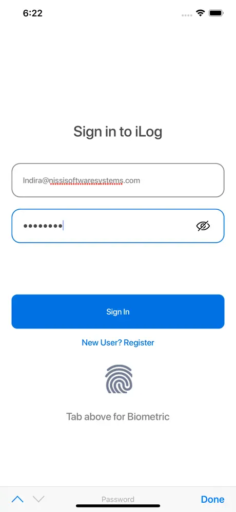
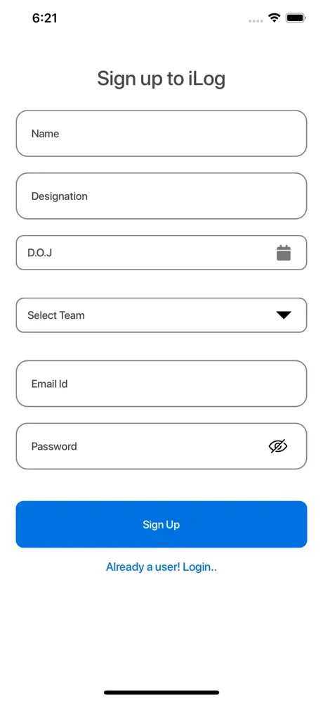
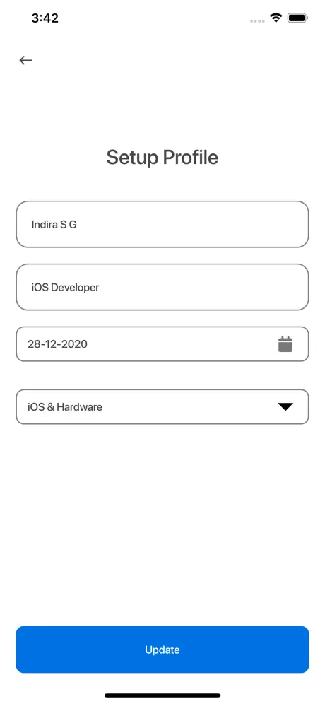
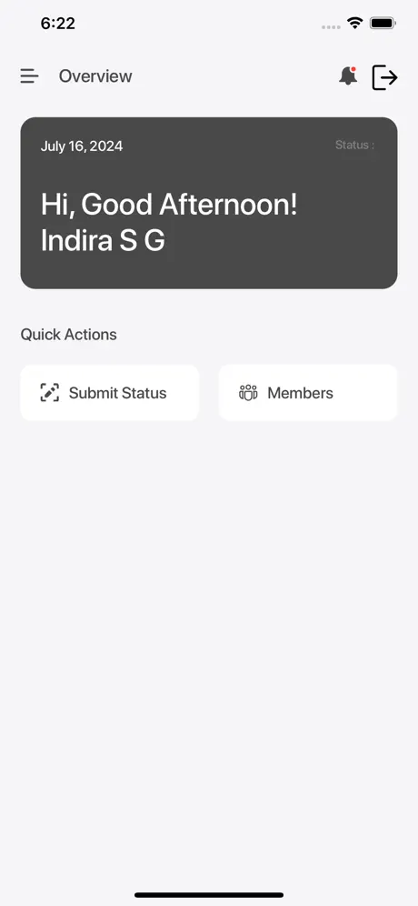
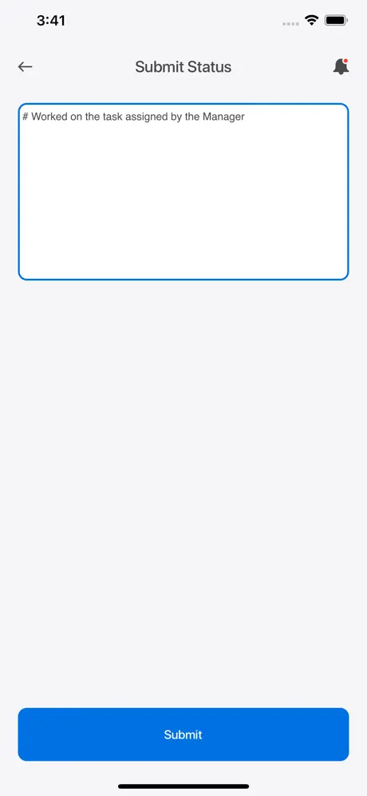
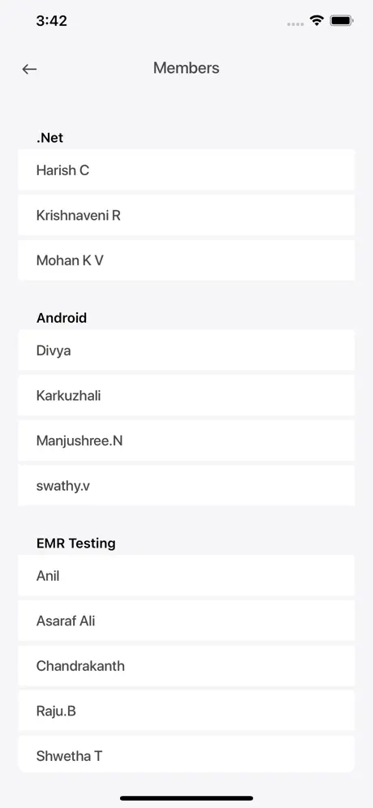

**Tech Used:**  
- Swift
- UIKit
- Firebase Firestore
- REST APIs
- Push Notifications
- Auto Layout
- Programmatic UI
- Git Version Control

## **📫 Connect with Me**  
- **LinkedIn:** (https://www.linkedin.com/in/poovarasan-k-/)  
- **Email:** (poovarasankg@gmail.com)  

